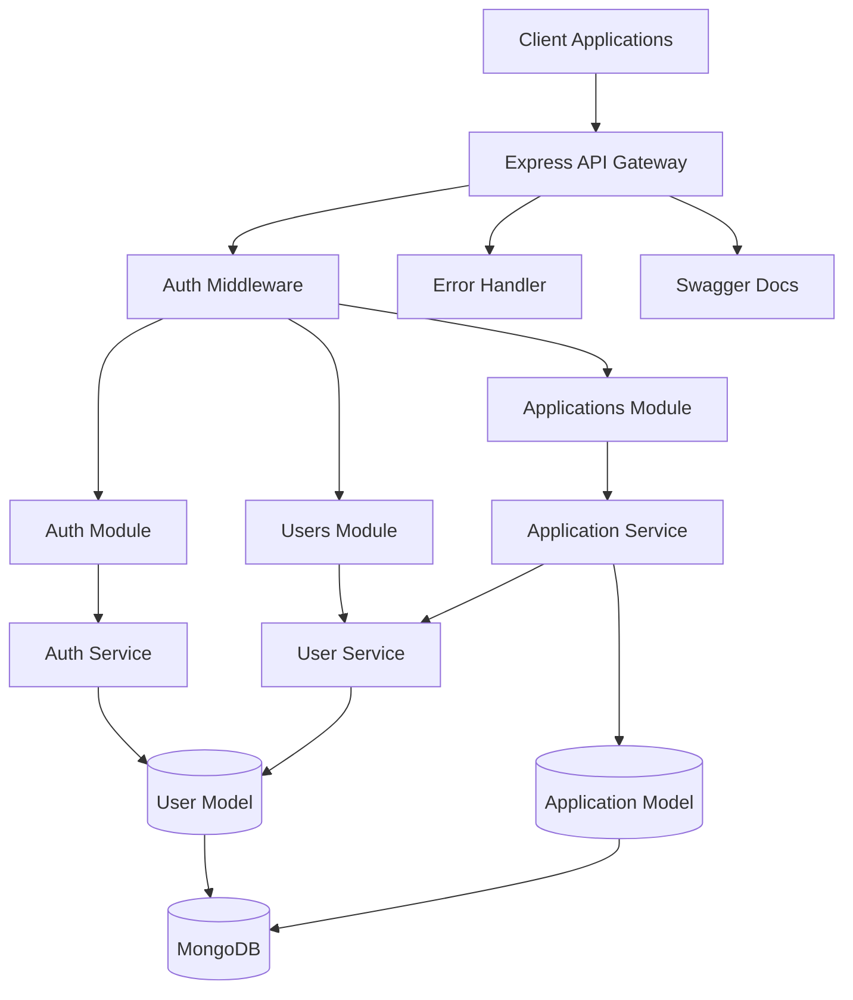
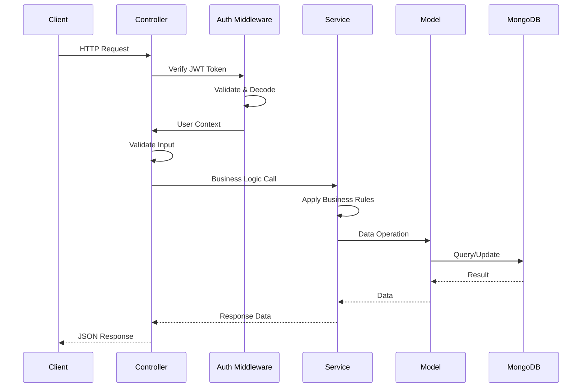
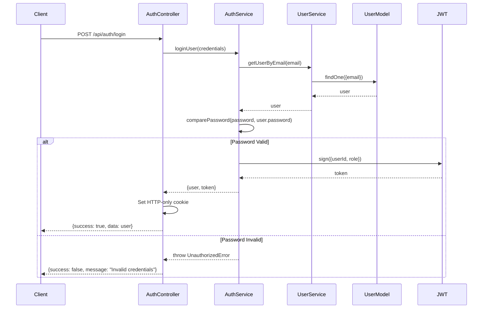
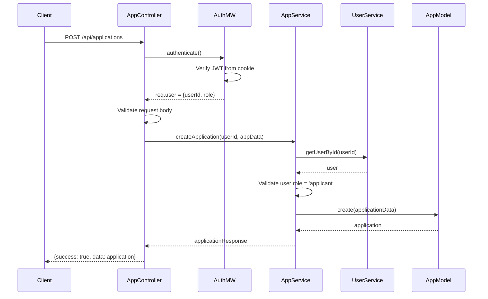
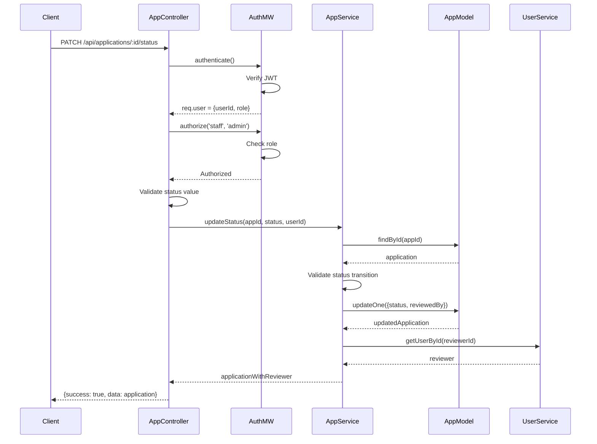

# Design Document: Startup Backend System

## Overview

The Startup Backend System is a scalable Node.js/Express backend implementing a modular monolith architecture for managing startup applications and government staff reviews. The system provides JWT-based authentication with HTTP-only cookies, role-based access control (applicant, staff, admin), and RESTful APIs for application submission and management. Built with MongoDB/Mongoose for data persistence, the architecture follows strict module isolation with controller → service → model patterns, ensuring each feature module owns its logic and data access. All endpoints are documented using Swagger/OpenAPI for interactive API exploration. The design prioritizes future scalability, allowing individual modules to be extracted into microservices as the system grows.

## Architecture

The system follows a modular monolith architecture with clear separation between presentation (controllers), business logic (services), and data access (models) layers. Each feature module is self-contained with its own routes, controllers, services, and models, communicating through service layer interfaces rather than direct database access.



## System Flow



## Components and Interfaces

### Component 1: Auth Module

**Purpose**: Handles user authentication, registration, and session management using JWT tokens stored in HTTP-only cookies.

**Interface**:
```typescript
interface AuthController {
  register(req: Request, res: Response, next: NextFunction): Promise<void>
  login(req: Request, res: Response, next: NextFunction): Promise<void>
  logout(req: Request, res: Response, next: NextFunction): Promise<void>
}

interface AuthService {
  registerUser(userData: RegisterDTO): Promise<UserResponse>
  loginUser(credentials: LoginDTO): Promise<LoginResponse>
  generateToken(userId: string, role: string): string
  verifyToken(token: string): TokenPayload
}
```

**Responsibilities**:
- User registration with password hashing (bcrypt)
- User authentication with JWT token generation
- Token validation and refresh
- Secure cookie management (HTTP-only, secure, sameSite)

### Component 2: Users Module

**Purpose**: Manages user data and profile operations with role-based access control.

**Interface**:
```typescript
interface UserController {
  getProfile(req: Request, res: Response, next: NextFunction): Promise<void>
  updateProfile(req: Request, res: Response, next: NextFunction): Promise<void>
}

interface UserService {
  getUserById(userId: string): Promise<UserResponse>
  getUserByEmail(email: string): Promise<UserResponse | null>
  createUser(userData: CreateUserDTO): Promise<UserResponse>
  updateUser(userId: string, updates: UpdateUserDTO): Promise<UserResponse>
  validateUserRole(userId: string, allowedRoles: string[]): Promise<boolean>
}
```

**Responsibilities**:
- User profile retrieval and updates
- User lookup by ID or email
- Role validation for authorization
- User data sanitization (exclude password from responses)

### Component 3: Applications Module

**Purpose**: Manages startup application submissions, reviews, and status updates.

**Interface**:
```typescript
interface ApplicationController {
  createApplication(req: Request, res: Response, next: NextFunction): Promise<void>
  getMyApplications(req: Request, res: Response, next: NextFunction): Promise<void>
  getAllApplications(req: Request, res: Response, next: NextFunction): Promise<void>
  getApplicationById(req: Request, res: Response, next: NextFunction): Promise<void>
  updateApplicationStatus(req: Request, res: Response, next: NextFunction): Promise<void>
}

interface ApplicationService {
  createApplication(userId: string, appData: CreateApplicationDTO): Promise<ApplicationResponse>
  getApplicationsByUser(userId: string): Promise<ApplicationResponse[]>
  getAllApplications(filters?: ApplicationFilters): Promise<ApplicationResponse[]>
  getApplicationById(appId: string): Promise<ApplicationResponse>
  updateStatus(appId: string, status: ApplicationStatus, reviewerId: string): Promise<ApplicationResponse>
  validateApplicationOwnership(appId: string, userId: string): Promise<boolean>
}
```

**Responsibilities**:
- Application creation and validation
- Application retrieval with filtering
- Status updates (pending → approved/rejected)
- Ownership validation for applicants
- Cross-module communication with UserService for reviewer data

### Component 4: Common Middleware

**Purpose**: Provides shared middleware for authentication, authorization, error handling, and request validation.

**Interface**:
```typescript
interface AuthMiddleware {
  authenticate(req: Request, res: Response, next: NextFunction): Promise<void>
  authorize(...roles: string[]): (req: Request, res: Response, next: NextFunction) => Promise<void>
}

interface ErrorMiddleware {
  notFound(req: Request, res: Response, next: NextFunction): void
  errorHandler(err: Error, req: Request, res: Response, next: NextFunction): void
}

interface ValidationMiddleware {
  validateRequest(schema: ValidationSchema): (req: Request, res: Response, next: NextFunction) => void
}
```

**Responsibilities**:
- JWT token extraction and verification from cookies
- Role-based authorization checks
- Centralized error handling with proper HTTP status codes
- Request body/query validation
- Consistent error response formatting

## Data Models

### Model 1: User

```typescript
interface User {
  _id: ObjectId
  name: string
  email: string
  password: string
  role: 'applicant' | 'staff' | 'admin'
  createdAt: Date
  updatedAt: Date
}

interface UserResponse {
  id: string
  name: string
  email: string
  role: string
  createdAt: Date
}
```

**Validation Rules**:
- `name`: Required, min 2 characters, max 100 characters
- `email`: Required, valid email format, unique index
- `password`: Required, min 8 characters (hashed with bcrypt, salt rounds: 10)
- `role`: Required, enum ['applicant', 'staff', 'admin'], default 'applicant'
- Password must never be included in API responses

**Mongoose Schema Features**:
- Timestamps enabled (createdAt, updatedAt)
- Pre-save hook for password hashing
- Instance method for password comparison
- Virtual field for id (maps _id to id)
- toJSON transform to exclude password and __v

### Model 2: StartupApplication

```typescript
interface StartupApplication {
  _id: ObjectId
  userId: ObjectId
  startupName: string
  description: string
  problemStatement: string
  solution: string
  targetMarket: string
  status: 'pending' | 'approved' | 'rejected'
  reviewedBy?: ObjectId
  createdAt: Date
  updatedAt: Date
}

interface ApplicationResponse {
  id: string
  userId: string
  startupName: string
  description: string
  problemStatement: string
  solution: string
  targetMarket: string
  status: string
  reviewedBy?: string
  createdAt: Date
  updatedAt: Date
}
```

**Validation Rules**:
- `userId`: Required, valid ObjectId, references User collection
- `startupName`: Required, min 3 characters, max 200 characters
- `description`: Required, min 10 characters, max 1000 characters
- `problemStatement`: Required, min 10 characters, max 1000 characters
- `solution`: Required, min 10 characters, max 1000 characters
- `targetMarket`: Required, min 5 characters, max 500 characters
- `status`: Required, enum ['pending', 'approved', 'rejected'], default 'pending'
- `reviewedBy`: Optional, valid ObjectId, references User collection (only set when status changes)

**Mongoose Schema Features**:
- Timestamps enabled (createdAt, updatedAt)
- Compound index on (userId, createdAt) for efficient user application queries
- Index on status for staff filtering
- Population support for userId and reviewedBy fields
- Virtual field for id (maps _id to id)

## Main Algorithm/Workflow

### Authentication Flow



### Application Submission Flow



### Application Status Update Flow



## Key Functions with Formal Specifications

### Function 1: AuthService.registerUser()

```typescript
async function registerUser(userData: RegisterDTO): Promise<UserResponse>
```

**Preconditions:**
- `userData.email` is a valid email format and not empty
- `userData.password` is at least 8 characters long
- `userData.name` is at least 2 characters long
- `userData.email` does not already exist in the database

**Postconditions:**
- Returns a UserResponse object with sanitized user data (no password)
- User document is created in MongoDB with hashed password
- Password is hashed using bcrypt with salt rounds = 10
- User role is set to 'applicant' by default if not specified
- Throws ConflictError if email already exists
- Throws ValidationError if input validation fails

**Loop Invariants:** N/A (no loops in this function)

### Function 2: AuthService.loginUser()

```typescript
async function loginUser(credentials: LoginDTO): Promise<LoginResponse>
```

**Preconditions:**
- `credentials.email` is a valid email format and not empty
- `credentials.password` is not empty
- User with given email exists in the database

**Postconditions:**
- Returns LoginResponse containing user data and JWT token
- JWT token contains payload: {userId, role, iat, exp}
- Token expiration is set to 7 days from creation
- Password comparison is performed using bcrypt.compare()
- Throws UnauthorizedError if email not found or password incorrect
- No password is included in the response

**Loop Invariants:** N/A (no loops in this function)

### Function 3: AuthMiddleware.authenticate()

```typescript
async function authenticate(req: Request, res: Response, next: NextFunction): Promise<void>
```

**Preconditions:**
- Request object contains cookies
- JWT_SECRET environment variable is configured

**Postconditions:**
- If valid token exists: `req.user` is populated with {userId, role}
- If valid token exists: next() is called to proceed to next middleware
- If no token: throws UnauthorizedError with message "No token provided"
- If invalid token: throws UnauthorizedError with message "Invalid token"
- If expired token: throws UnauthorizedError with message "Token expired"
- Token is extracted from HTTP-only cookie named 'token'

**Loop Invariants:** N/A (no loops in this function)

### Function 4: ApplicationService.createApplication()

```typescript
async function createApplication(userId: string, appData: CreateApplicationDTO): Promise<ApplicationResponse>
```

**Preconditions:**
- `userId` is a valid MongoDB ObjectId
- User with `userId` exists and has role 'applicant'
- `appData.startupName` is between 3-200 characters
- `appData.description` is between 10-1000 characters
- `appData.problemStatement` is between 10-1000 characters
- `appData.solution` is between 10-1000 characters
- `appData.targetMarket` is between 5-500 characters

**Postconditions:**
- Returns ApplicationResponse with created application data
- Application document is created in MongoDB with status 'pending'
- Application.userId is set to the provided userId
- Application.reviewedBy is null/undefined
- Throws ForbiddenError if user role is not 'applicant'
- Throws ValidationError if any field validation fails
- Throws NotFoundError if userId does not exist

**Loop Invariants:** N/A (no loops in this function)

### Function 5: ApplicationService.updateStatus()

```typescript
async function updateStatus(appId: string, status: ApplicationStatus, reviewerId: string): Promise<ApplicationResponse>
```

**Preconditions:**
- `appId` is a valid MongoDB ObjectId
- Application with `appId` exists in the database
- `status` is one of: 'pending', 'approved', 'rejected'
- `reviewerId` is a valid MongoDB ObjectId
- User with `reviewerId` exists and has role 'staff' or 'admin'

**Postconditions:**
- Returns ApplicationResponse with updated application data
- Application.status is updated to the provided status
- Application.reviewedBy is set to reviewerId
- Application.updatedAt timestamp is updated automatically
- Throws NotFoundError if application does not exist
- Throws ValidationError if status is invalid
- Throws ForbiddenError if reviewer role is not 'staff' or 'admin'

**Loop Invariants:** N/A (no loops in this function)

### Function 6: AuthMiddleware.authorize()

```typescript
function authorize(...allowedRoles: string[]): (req: Request, res: Response, next: NextFunction) => Promise<void>
```

**Preconditions:**
- `allowedRoles` array contains at least one role string
- `req.user` exists (authenticate middleware has been called first)
- `req.user.role` is defined

**Postconditions:**
- If user role is in allowedRoles: next() is called
- If user role is not in allowedRoles: throws ForbiddenError
- Returns a middleware function that performs the authorization check
- No modification to req.user object

**Loop Invariants:** 
- When checking roles: all previously checked roles were not matching

## Algorithmic Pseudocode

### Main Authentication Algorithm

```typescript
ALGORITHM authenticateUser(email, password)
INPUT: email (string), password (string)
OUTPUT: {user: UserResponse, token: string}

BEGIN
  ASSERT email is valid email format
  ASSERT password is not empty
  
  // Step 1: Find user by email
  user ← database.users.findOne({email: email})
  
  IF user IS NULL THEN
    THROW UnauthorizedError("Invalid credentials")
  END IF
  
  // Step 2: Verify password
  isPasswordValid ← bcrypt.compare(password, user.password)
  
  IF NOT isPasswordValid THEN
    THROW UnauthorizedError("Invalid credentials")
  END IF
  
  // Step 3: Generate JWT token
  tokenPayload ← {
    userId: user._id,
    role: user.role
  }
  
  token ← jwt.sign(tokenPayload, JWT_SECRET, {expiresIn: '7d'})
  
  // Step 4: Sanitize user data (remove password)
  userResponse ← {
    id: user._id,
    name: user.name,
    email: user.email,
    role: user.role,
    createdAt: user.createdAt
  }
  
  ASSERT token is not empty
  ASSERT userResponse does not contain password
  
  RETURN {user: userResponse, token: token}
END
```

**Preconditions:**
- email is valid email format
- password is non-empty string
- Database connection is established
- JWT_SECRET is configured

**Postconditions:**
- Returns user object without password and valid JWT token
- Token is signed with JWT_SECRET and expires in 7 days
- Throws UnauthorizedError if credentials are invalid

**Loop Invariants:** N/A

### User Registration Algorithm

```typescript
ALGORITHM registerUser(name, email, password, role)
INPUT: name (string), email (string), password (string), role (string, optional)
OUTPUT: UserResponse

BEGIN
  ASSERT name.length >= 2 AND name.length <= 100
  ASSERT email matches email regex pattern
  ASSERT password.length >= 8
  ASSERT role IN ['applicant', 'staff', 'admin'] OR role IS NULL
  
  // Step 1: Check if email already exists
  existingUser ← database.users.findOne({email: email})
  
  IF existingUser IS NOT NULL THEN
    THROW ConflictError("Email already registered")
  END IF
  
  // Step 2: Hash password
  saltRounds ← 10
  hashedPassword ← bcrypt.hash(password, saltRounds)
  
  // Step 3: Set default role if not provided
  userRole ← role OR 'applicant'
  
  // Step 4: Create user document
  userData ← {
    name: name,
    email: email,
    password: hashedPassword,
    role: userRole
  }
  
  newUser ← database.users.create(userData)
  
  // Step 5: Sanitize response
  userResponse ← {
    id: newUser._id,
    name: newUser.name,
    email: newUser.email,
    role: newUser.role,
    createdAt: newUser.createdAt
  }
  
  ASSERT userResponse does not contain password
  ASSERT newUser._id is not null
  
  RETURN userResponse
END
```

**Preconditions:**
- name is 2-100 characters
- email is valid format and unique
- password is at least 8 characters
- role is valid enum value or null

**Postconditions:**
- User is created in database with hashed password
- Returns sanitized user object without password
- Throws ConflictError if email exists
- Throws ValidationError if input validation fails

**Loop Invariants:** N/A

### Application Creation Algorithm

```typescript
ALGORITHM createApplication(userId, applicationData)
INPUT: userId (ObjectId), applicationData (CreateApplicationDTO)
OUTPUT: ApplicationResponse

BEGIN
  ASSERT userId is valid ObjectId
  ASSERT applicationData.startupName.length >= 3 AND <= 200
  ASSERT applicationData.description.length >= 10 AND <= 1000
  ASSERT applicationData.problemStatement.length >= 10 AND <= 1000
  ASSERT applicationData.solution.length >= 10 AND <= 1000
  ASSERT applicationData.targetMarket.length >= 5 AND <= 500
  
  // Step 1: Verify user exists and has correct role
  user ← userService.getUserById(userId)
  
  IF user IS NULL THEN
    THROW NotFoundError("User not found")
  END IF
  
  IF user.role != 'applicant' THEN
    THROW ForbiddenError("Only applicants can create applications")
  END IF
  
  // Step 2: Create application document
  appData ← {
    userId: userId,
    startupName: applicationData.startupName,
    description: applicationData.description,
    problemStatement: applicationData.problemStatement,
    solution: applicationData.solution,
    targetMarket: applicationData.targetMarket,
    status: 'pending',
    reviewedBy: null
  }
  
  application ← database.applications.create(appData)
  
  // Step 3: Format response
  appResponse ← {
    id: application._id,
    userId: application.userId,
    startupName: application.startupName,
    description: application.description,
    problemStatement: application.problemStatement,
    solution: application.solution,
    targetMarket: application.targetMarket,
    status: application.status,
    reviewedBy: application.reviewedBy,
    createdAt: application.createdAt,
    updatedAt: application.updatedAt
  }
  
  ASSERT appResponse.status = 'pending'
  ASSERT appResponse.reviewedBy IS NULL
  
  RETURN appResponse
END
```

**Preconditions:**
- userId exists and belongs to an applicant
- All application fields meet length requirements
- Database connection is active

**Postconditions:**
- Application is created with status 'pending'
- reviewedBy is null
- Returns complete application data
- Throws appropriate errors for validation failures

**Loop Invariants:** N/A

### Application Status Update Algorithm

```typescript
ALGORITHM updateApplicationStatus(appId, newStatus, reviewerId)
INPUT: appId (ObjectId), newStatus (string), reviewerId (ObjectId)
OUTPUT: ApplicationResponse

BEGIN
  ASSERT appId is valid ObjectId
  ASSERT newStatus IN ['pending', 'approved', 'rejected']
  ASSERT reviewerId is valid ObjectId
  
  // Step 1: Verify reviewer has correct role
  reviewer ← userService.getUserById(reviewerId)
  
  IF reviewer IS NULL THEN
    THROW NotFoundError("Reviewer not found")
  END IF
  
  IF reviewer.role NOT IN ['staff', 'admin'] THEN
    THROW ForbiddenError("Only staff or admin can update application status")
  END IF
  
  // Step 2: Find application
  application ← database.applications.findById(appId)
  
  IF application IS NULL THEN
    THROW NotFoundError("Application not found")
  END IF
  
  // Step 3: Validate status transition (optional business rule)
  IF application.status = newStatus THEN
    THROW ValidationError("Application already has this status")
  END IF
  
  // Step 4: Update application
  updateData ← {
    status: newStatus,
    reviewedBy: reviewerId,
    updatedAt: currentTimestamp()
  }
  
  updatedApp ← database.applications.updateOne(
    {_id: appId},
    updateData
  )
  
  // Step 5: Populate reviewer data for response
  populatedApp ← database.applications.findById(appId)
    .populate('userId', 'name email')
    .populate('reviewedBy', 'name email')
  
  // Step 6: Format response
  appResponse ← {
    id: populatedApp._id,
    userId: populatedApp.userId._id,
    startupName: populatedApp.startupName,
    description: populatedApp.description,
    problemStatement: populatedApp.problemStatement,
    solution: populatedApp.solution,
    targetMarket: populatedApp.targetMarket,
    status: populatedApp.status,
    reviewedBy: populatedApp.reviewedBy._id,
    createdAt: populatedApp.createdAt,
    updatedAt: populatedApp.updatedAt
  }
  
  ASSERT appResponse.status = newStatus
  ASSERT appResponse.reviewedBy = reviewerId
  
  RETURN appResponse
END
```

**Preconditions:**
- appId exists in database
- reviewerId exists and has role 'staff' or 'admin'
- newStatus is valid enum value

**Postconditions:**
- Application status is updated to newStatus
- reviewedBy field is set to reviewerId
- updatedAt timestamp is current
- Returns updated application with populated user data
- Throws appropriate errors for validation failures

**Loop Invariants:** N/A

### JWT Token Verification Algorithm

```typescript
ALGORITHM verifyJWTToken(token)
INPUT: token (string)
OUTPUT: TokenPayload {userId: string, role: string}

BEGIN
  ASSERT token is not empty
  ASSERT JWT_SECRET is configured
  
  TRY
    // Step 1: Verify and decode token
    payload ← jwt.verify(token, JWT_SECRET)
    
    // Step 2: Validate payload structure
    IF payload.userId IS NULL OR payload.role IS NULL THEN
      THROW UnauthorizedError("Invalid token payload")
    END IF
    
    // Step 3: Check expiration (handled by jwt.verify)
    // jwt.verify automatically throws if token is expired
    
    // Step 4: Return decoded payload
    tokenPayload ← {
      userId: payload.userId,
      role: payload.role
    }
    
    ASSERT tokenPayload.userId is not null
    ASSERT tokenPayload.role IN ['applicant', 'staff', 'admin']
    
    RETURN tokenPayload
    
  CATCH JsonWebTokenError
    THROW UnauthorizedError("Invalid token")
  CATCH TokenExpiredError
    THROW UnauthorizedError("Token expired")
  END TRY
END
```

**Preconditions:**
- token is non-empty string
- JWT_SECRET environment variable is set
- token was previously signed with the same JWT_SECRET

**Postconditions:**
- Returns decoded payload with userId and role
- Throws UnauthorizedError if token is invalid or expired
- Payload structure is validated

**Loop Invariants:** N/A

## Example Usage

### Example 1: User Registration and Login

```typescript
// Register a new applicant
const registerData = {
  name: "John Doe",
  email: "john@startup.com",
  password: "SecurePass123",
  role: "applicant"
}

const response = await fetch('/api/auth/register', {
  method: 'POST',
  headers: { 'Content-Type': 'application/json' },
  body: JSON.stringify(registerData)
})

const result = await response.json()
// result = {
//   success: true,
//   data: {
//     id: "507f1f77bcf86cd799439011",
//     name: "John Doe",
//     email: "john@startup.com",
//     role: "applicant",
//     createdAt: "2024-01-15T10:30:00.000Z"
//   },
//   message: "User registered successfully"
// }

// Login with credentials
const loginData = {
  email: "john@startup.com",
  password: "SecurePass123"
}

const loginResponse = await fetch('/api/auth/login', {
  method: 'POST',
  headers: { 'Content-Type': 'application/json' },
  credentials: 'include', // Important: include cookies
  body: JSON.stringify(loginData)
})

const loginResult = await loginResponse.json()
// HTTP-only cookie 'token' is automatically set by server
// loginResult = {
//   success: true,
//   data: {
//     id: "507f1f77bcf86cd799439011",
//     name: "John Doe",
//     email: "john@startup.com",
//     role: "applicant"
//   },
//   message: "Login successful"
// }
```

### Example 2: Create Application (Applicant)

```typescript
// Applicant creates a new startup application
const applicationData = {
  startupName: "EcoTech Solutions",
  description: "A platform connecting eco-conscious consumers with sustainable products",
  problemStatement: "Consumers struggle to find verified sustainable products in one place",
  solution: "Centralized marketplace with verified eco-certifications and carbon footprint tracking",
  targetMarket: "Environmentally conscious millennials and Gen Z consumers in urban areas"
}

const createResponse = await fetch('/api/applications', {
  method: 'POST',
  headers: { 'Content-Type': 'application/json' },
  credentials: 'include', // JWT token in cookie
  body: JSON.stringify(applicationData)
})

const createResult = await createResponse.json()
// createResult = {
//   success: true,
//   data: {
//     id: "507f1f77bcf86cd799439012",
//     userId: "507f1f77bcf86cd799439011",
//     startupName: "EcoTech Solutions",
//     description: "A platform connecting eco-conscious consumers...",
//     problemStatement: "Consumers struggle to find verified...",
//     solution: "Centralized marketplace with verified...",
//     targetMarket: "Environmentally conscious millennials...",
//     status: "pending",
//     reviewedBy: null,
//     createdAt: "2024-01-15T11:00:00.000Z",
//     updatedAt: "2024-01-15T11:00:00.000Z"
//   },
//   message: "Application created successfully"
// }
```

### Example 3: View Applications (Staff)

```typescript
// Staff member views all applications
const staffResponse = await fetch('/api/applications', {
  method: 'GET',
  credentials: 'include', // JWT token with role 'staff'
})

const staffResult = await staffResponse.json()
// staffResult = {
//   success: true,
//   data: [
//     {
//       id: "507f1f77bcf86cd799439012",
//       userId: "507f1f77bcf86cd799439011",
//       startupName: "EcoTech Solutions",
//       status: "pending",
//       createdAt: "2024-01-15T11:00:00.000Z",
//       ...
//     },
//     {
//       id: "507f1f77bcf86cd799439013",
//       userId: "507f1f77bcf86cd799439014",
//       startupName: "HealthAI",
//       status: "approved",
//       reviewedBy: "507f1f77bcf86cd799439015",
//       ...
//     }
//   ],
//   message: "Applications retrieved successfully"
// }

// Staff views single application details
const detailResponse = await fetch('/api/applications/507f1f77bcf86cd799439012', {
  method: 'GET',
  credentials: 'include'
})

const detailResult = await detailResponse.json()
// Returns full application details with populated user data
```

### Example 4: Update Application Status (Staff)

```typescript
// Staff approves an application
const statusUpdateData = {
  status: "approved"
}

const updateResponse = await fetch('/api/applications/507f1f77bcf86cd799439012/status', {
  method: 'PATCH',
  headers: { 'Content-Type': 'application/json' },
  credentials: 'include', // JWT token with role 'staff' or 'admin'
  body: JSON.stringify(statusUpdateData)
})

const updateResult = await updateResponse.json()
// updateResult = {
//   success: true,
//   data: {
//     id: "507f1f77bcf86cd799439012",
//     userId: "507f1f77bcf86cd799439011",
//     startupName: "EcoTech Solutions",
//     status: "approved",
//     reviewedBy: "507f1f77bcf86cd799439015", // Staff member's ID
//     updatedAt: "2024-01-15T14:30:00.000Z",
//     ...
//   },
//   message: "Application status updated successfully"
// }
```

### Example 5: Error Handling

```typescript
// Attempt to create application without authentication
const unauthResponse = await fetch('/api/applications', {
  method: 'POST',
  headers: { 'Content-Type': 'application/json' },
  body: JSON.stringify(applicationData)
  // No credentials included
})

const unauthResult = await unauthResponse.json()
// unauthResult = {
//   success: false,
//   message: "No token provided"
// }
// HTTP Status: 401 Unauthorized

// Attempt to update status as applicant (forbidden)
const forbiddenResponse = await fetch('/api/applications/507f1f77bcf86cd799439012/status', {
  method: 'PATCH',
  headers: { 'Content-Type': 'application/json' },
  credentials: 'include', // Token with role 'applicant'
  body: JSON.stringify({ status: "approved" })
})

const forbiddenResult = await forbiddenResponse.json()
// forbiddenResult = {
//   success: false,
//   message: "Access denied. Insufficient permissions"
// }
// HTTP Status: 403 Forbidden

// Validation error example
const invalidData = {
  startupName: "AB", // Too short (min 3 chars)
  description: "Short", // Too short (min 10 chars)
  problemStatement: "Problem",
  solution: "Solution",
  targetMarket: "Mark"
}

const validationResponse = await fetch('/api/applications', {
  method: 'POST',
  headers: { 'Content-Type': 'application/json' },
  credentials: 'include',
  body: JSON.stringify(invalidData)
})

const validationResult = await validationResponse.json()
// validationResult = {
//   success: false,
//   message: "Validation failed",
//   errors: [
//     "startupName must be at least 3 characters",
//     "description must be at least 10 characters"
//   ]
// }
// HTTP Status: 400 Bad Request
```

## Correctness Properties

### Universal Quantification Statements

1. **Authentication Security**
   - ∀ user ∈ Users: user.password is hashed using bcrypt with salt rounds ≥ 10
   - ∀ token ∈ JWTTokens: token is signed with JWT_SECRET and contains {userId, role, exp}
   - ∀ response ∈ APIResponses: response does NOT contain user.password field
   - ∀ cookie ∈ AuthCookies: cookie has httpOnly=true AND secure=true (in production) AND sameSite='strict'

2. **Authorization Rules**
   - ∀ request ∈ ProtectedEndpoints: request must have valid JWT token in cookie
   - ∀ application ∈ Applications: application.create() requires user.role = 'applicant'
   - ∀ statusUpdate ∈ StatusUpdates: statusUpdate requires user.role ∈ {'staff', 'admin'}
   - ∀ user ∈ Users: user can only view their own applications unless user.role ∈ {'staff', 'admin'}

3. **Data Integrity**
   - ∀ application ∈ Applications: application.status ∈ {'pending', 'approved', 'rejected'}
   - ∀ application ∈ Applications: (application.status ≠ 'pending') ⟹ (application.reviewedBy ≠ null)
   - ∀ user ∈ Users: user.email is unique across all users
   - ∀ application ∈ Applications: application.userId references valid User._id

4. **API Response Format**
   - ∀ response ∈ SuccessResponses: response.success = true AND response.data exists
   - ∀ response ∈ ErrorResponses: response.success = false AND response.message exists
   - ∀ response ∈ APIResponses: response has Content-Type = 'application/json'
   - ∀ error ∈ Errors: error has appropriate HTTP status code (400, 401, 403, 404, 500)

5. **Module Isolation**
   - ∀ module ∈ Modules: module does NOT directly access other module's models
   - ∀ crossModuleCall ∈ CrossModuleCalls: crossModuleCall goes through service layer
   - ∀ controller ∈ Controllers: controller does NOT contain business logic
   - ∀ controller ∈ Controllers: controller does NOT directly access database models

6. **Validation Rules**
   - ∀ user ∈ Users: user.name.length ≥ 2 AND user.name.length ≤ 100
   - ∀ user ∈ Users: user.password.length ≥ 8 (before hashing)
   - ∀ application ∈ Applications: application.startupName.length ≥ 3 AND ≤ 200
   - ∀ application ∈ Applications: application.description.length ≥ 10 AND ≤ 1000
   - ∀ field ∈ RequiredFields: field is NOT null AND field is NOT empty string

7. **Swagger Documentation**
   - ∀ endpoint ∈ APIEndpoints: endpoint has Swagger/OpenAPI documentation
   - ∀ swaggerDoc ∈ SwaggerDocs: swaggerDoc includes {summary, description, tags, requestBody, responses}
   - ∀ schema ∈ SwaggerSchemas: schema matches actual data model structure
   - ∀ protectedEndpoint ∈ ProtectedEndpoints: swaggerDoc specifies security requirement (Bearer JWT)

## Error Handling

### Error Scenario 1: Unauthenticated Access

**Condition**: User attempts to access protected endpoint without valid JWT token
**Response**: 
- HTTP Status: 401 Unauthorized
- Response Body: `{success: false, message: "No token provided"}` or `{success: false, message: "Invalid token"}`
**Recovery**: User must login via `/api/auth/login` to obtain valid token

### Error Scenario 2: Unauthorized Access (Insufficient Permissions)

**Condition**: User with role 'applicant' attempts to access staff-only endpoint (e.g., update application status)
**Response**:
- HTTP Status: 403 Forbidden
- Response Body: `{success: false, message: "Access denied. Insufficient permissions"}`
**Recovery**: User must have appropriate role ('staff' or 'admin') to access the resource

### Error Scenario 3: Validation Error

**Condition**: Request body fails validation (e.g., missing required fields, invalid format, length constraints)
**Response**:
- HTTP Status: 400 Bad Request
- Response Body: `{success: false, message: "Validation failed", errors: [array of error messages]}`
**Recovery**: Client must correct input data and resubmit request

### Error Scenario 4: Resource Not Found

**Condition**: Requested resource (user, application) does not exist in database
**Response**:
- HTTP Status: 404 Not Found
- Response Body: `{success: false, message: "Resource not found"}`
**Recovery**: Client should verify resource ID and ensure resource exists

### Error Scenario 5: Duplicate Email Registration

**Condition**: User attempts to register with email that already exists
**Response**:
- HTTP Status: 409 Conflict
- Response Body: `{success: false, message: "Email already registered"}`
**Recovery**: User should login with existing account or use different email

### Error Scenario 6: Database Connection Error

**Condition**: MongoDB connection fails or times out
**Response**:
- HTTP Status: 500 Internal Server Error
- Response Body: `{success: false, message: "Database connection error"}`
**Recovery**: System should retry connection, log error, and alert administrators

### Error Scenario 7: JWT Token Expired

**Condition**: User's JWT token has exceeded expiration time (7 days)
**Response**:
- HTTP Status: 401 Unauthorized
- Response Body: `{success: false, message: "Token expired"}`
**Recovery**: User must login again to obtain new token

### Error Scenario 8: Invalid Status Transition

**Condition**: Staff attempts to update application to same status it already has
**Response**:
- HTTP Status: 400 Bad Request
- Response Body: `{success: false, message: "Application already has this status"}`
**Recovery**: Staff should verify current status before updating

## Testing Strategy

### Unit Testing Approach

**Framework**: Jest with Supertest for HTTP testing

**Coverage Goals**: Minimum 80% code coverage for services and controllers

**Key Test Cases**:

1. **Auth Service Tests**
   - User registration with valid data succeeds
   - User registration with duplicate email fails
   - User registration with invalid email format fails
   - User registration with short password fails
   - Login with valid credentials succeeds and returns token
   - Login with invalid email fails
   - Login with invalid password fails
   - Token generation creates valid JWT with correct payload
   - Token verification succeeds with valid token
   - Token verification fails with expired token
   - Token verification fails with invalid signature

2. **User Service Tests**
   - Get user by ID returns correct user
   - Get user by email returns correct user
   - Get user by non-existent ID returns null
   - Create user hashes password correctly
   - Update user modifies only allowed fields
   - User response excludes password field

3. **Application Service Tests**
   - Create application with valid data succeeds
   - Create application by non-applicant fails
   - Create application with invalid data fails
   - Get applications by user returns only user's applications
   - Get all applications returns all applications (staff only)
   - Update status with valid data succeeds
   - Update status by non-staff fails
   - Update status for non-existent application fails
   - Update status sets reviewedBy field correctly

4. **Middleware Tests**
   - Authenticate middleware extracts token from cookie
   - Authenticate middleware populates req.user with decoded payload
   - Authenticate middleware rejects missing token
   - Authenticate middleware rejects invalid token
   - Authorize middleware allows access for correct roles
   - Authorize middleware denies access for incorrect roles
   - Error handler middleware formats errors correctly
   - Error handler middleware sets correct HTTP status codes

5. **Controller Tests**
   - Controllers call appropriate service methods
   - Controllers return correct response format
   - Controllers handle service errors properly
   - Controllers validate request bodies
   - Controllers set correct HTTP status codes

### Property-Based Testing Approach

**Property Test Library**: fast-check (for JavaScript/TypeScript)

**Key Properties to Test**:

1. **Password Hashing Property**
   - Property: ∀ password ∈ ValidPasswords: bcrypt.compare(password, hash(password)) = true
   - Property: ∀ password1, password2 ∈ ValidPasswords where password1 ≠ password2: hash(password1) ≠ hash(password2)
   - Generator: Arbitrary strings of length 8-100

2. **JWT Token Property**
   - Property: ∀ payload ∈ ValidPayloads: verify(sign(payload)) = payload
   - Property: ∀ token ∈ ValidTokens: verify(token) does not throw OR throws specific error
   - Generator: Arbitrary objects with userId and role fields

3. **Email Uniqueness Property**
   - Property: ∀ email ∈ ValidEmails: registerUser(email) succeeds once, fails on second attempt
   - Generator: Arbitrary valid email strings

4. **Application Status Transition Property**
   - Property: ∀ app ∈ Applications: updateStatus(app, status) ⟹ app.status = status AND app.reviewedBy ≠ null
   - Generator: Arbitrary application objects and status values

5. **Response Format Property**
   - Property: ∀ response ∈ APIResponses: response has 'success' field AND (response.data OR response.message)
   - Generator: Arbitrary API endpoint calls

6. **Validation Property**
   - Property: ∀ input ∈ InvalidInputs: validate(input) throws ValidationError
   - Property: ∀ input ∈ ValidInputs: validate(input) does not throw
   - Generator: Arbitrary objects with various field combinations

### Integration Testing Approach

**Framework**: Jest with MongoDB Memory Server for isolated database testing

**Key Integration Tests**:

1. **End-to-End Authentication Flow**
   - Register user → Login → Access protected endpoint → Logout
   - Verify token is set in cookie after login
   - Verify token is cleared after logout
   - Verify protected endpoint rejects unauthenticated requests

2. **Application Lifecycle Flow**
   - Applicant registers → Creates application → Views own applications
   - Staff logs in → Views all applications → Updates status
   - Applicant views updated application status
   - Verify status changes are persisted
   - Verify reviewedBy field is set correctly

3. **Authorization Flow**
   - Applicant attempts to access staff endpoint (should fail)
   - Staff attempts to create application (should fail)
   - Admin can access all endpoints
   - Verify role-based access control works correctly

4. **Database Integration**
   - Create user → Verify in database
   - Create application → Verify foreign key relationship
   - Update application → Verify timestamps update
   - Delete operations cascade correctly (if applicable)

5. **Error Handling Integration**
   - Trigger various errors → Verify correct error responses
   - Verify error middleware catches all errors
   - Verify error logging works correctly

## Performance Considerations

### Database Indexing Strategy

1. **User Collection Indexes**
   - Unique index on `email` field for fast lookup and uniqueness constraint
   - Index on `role` field for role-based queries (if needed for admin features)

2. **Application Collection Indexes**
   - Compound index on `(userId, createdAt)` for efficient user application queries sorted by date
   - Index on `status` field for staff filtering by application status
   - Index on `reviewedBy` field for reviewer performance tracking (future feature)

### Query Optimization

1. **Pagination**: Implement cursor-based or offset-based pagination for `/api/applications` endpoint to handle large datasets
2. **Field Selection**: Use Mongoose `.select()` to return only required fields, reducing payload size
3. **Population**: Limit populated fields to essential data only (e.g., populate only name and email for users)

### Caching Strategy (Future Enhancement)

1. **Redis Integration**: Cache frequently accessed data (user profiles, application lists)
2. **Cache Invalidation**: Invalidate cache on data updates (status changes, profile updates)
3. **TTL Strategy**: Set appropriate time-to-live for different data types

### Response Time Targets

- Authentication endpoints: < 200ms
- Application creation: < 300ms
- Application listing (paginated): < 500ms
- Status updates: < 200ms

### Scalability Considerations

1. **Horizontal Scaling**: Stateless API design allows multiple server instances behind load balancer
2. **Database Connection Pooling**: Configure Mongoose connection pool size based on load
3. **Rate Limiting**: Implement rate limiting middleware to prevent abuse (e.g., 100 requests per 15 minutes per IP)

## Security Considerations

### Authentication Security

1. **Password Security**
   - Passwords hashed using bcrypt with salt rounds = 10 (minimum)
   - Passwords never stored in plain text
   - Passwords never returned in API responses
   - Password minimum length: 8 characters (enforce stronger requirements in production)

2. **JWT Token Security**
   - Tokens stored in HTTP-only cookies (not accessible via JavaScript)
   - Secure flag enabled in production (HTTPS only)
   - SameSite attribute set to 'strict' to prevent CSRF attacks
   - Token expiration: 7 days (configurable)
   - JWT_SECRET must be strong, random, and stored in environment variables

3. **Session Management**
   - Logout endpoint clears authentication cookie
   - Token refresh mechanism (future enhancement)
   - Implement token blacklist for revoked tokens (future enhancement)

### Authorization Security

1. **Role-Based Access Control (RBAC)**
   - Strict role validation on all protected endpoints
   - Middleware-based authorization checks
   - Principle of least privilege: users can only access resources they own or are authorized for

2. **Resource Ownership Validation**
   - Applicants can only view/modify their own applications
   - Staff can view all applications but cannot modify user data
   - Admin has full access (implement carefully with audit logging)

### Input Validation & Sanitization

1. **Request Validation**
   - Validate all input data against schemas
   - Sanitize user input to prevent injection attacks
   - Use validation middleware before controller logic
   - Reject requests with unexpected fields

2. **MongoDB Injection Prevention**
   - Use Mongoose parameterized queries (built-in protection)
   - Validate ObjectId format before queries
   - Never construct queries from raw user input

### API Security

1. **CORS Configuration**
   - Configure CORS to allow only trusted frontend origins
   - Restrict allowed methods and headers
   - Enable credentials for cookie-based authentication

2. **Rate Limiting**
   - Implement rate limiting to prevent brute force attacks
   - Different limits for different endpoint types (stricter for auth endpoints)
   - Consider IP-based and user-based rate limiting

3. **HTTPS Enforcement**
   - Enforce HTTPS in production
   - Redirect HTTP to HTTPS
   - Set secure flag on cookies in production

4. **Security Headers**
   - Use helmet.js middleware for security headers
   - Content-Security-Policy
   - X-Content-Type-Options: nosniff
   - X-Frame-Options: DENY
   - X-XSS-Protection: 1; mode=block

### Data Security

1. **Sensitive Data Protection**
   - Never log passwords or tokens
   - Mask sensitive data in logs
   - Implement audit logging for sensitive operations (status updates, role changes)

2. **Database Security**
   - Use MongoDB authentication
   - Restrict database user permissions
   - Enable MongoDB encryption at rest (production)
   - Regular database backups

### Error Handling Security

1. **Error Message Sanitization**
   - Never expose stack traces in production
   - Return generic error messages to clients
   - Log detailed errors server-side only
   - Avoid leaking system information in error responses

2. **Error Logging**
   - Log all errors with context (user ID, endpoint, timestamp)
   - Use structured logging (JSON format)
   - Implement log aggregation and monitoring

## Dependencies

### Core Dependencies

1. **express** (^4.18.0): Web application framework
2. **mongoose** (^8.0.0): MongoDB ODM for data modeling and validation
3. **jsonwebtoken** (^9.0.0): JWT token generation and verification
4. **bcryptjs** (^2.4.3): Password hashing library
5. **cookie-parser** (^1.4.6): Parse cookies from HTTP requests
6. **dotenv** (^16.0.0): Environment variable management
7. **cors** (^2.8.5): Cross-Origin Resource Sharing middleware
8. **helmet** (^7.0.0): Security headers middleware

### Documentation Dependencies

1. **swagger-jsdoc** (^6.2.0): Generate OpenAPI specification from JSDoc comments
2. **swagger-ui-express** (^5.0.0): Serve Swagger UI for API documentation

### Development Dependencies

1. **jest** (^29.0.0): Testing framework
2. **supertest** (^6.3.0): HTTP assertion library for API testing
3. **mongodb-memory-server** (^9.0.0): In-memory MongoDB for testing
4. **nodemon** (^3.0.0): Auto-restart server during development
5. **eslint** (^8.50.0): Code linting
6. **prettier** (^3.0.0): Code formatting

### Optional Dependencies (Future Enhancements)

1. **express-rate-limit** (^7.0.0): Rate limiting middleware
2. **winston** (^3.11.0): Advanced logging library
3. **joi** or **yup**: Schema validation libraries
4. **redis** (^4.6.0): Caching layer
5. **bull** (^4.11.0): Job queue for background tasks

## Module Structure Details

### Auth Module Structure

```
src/modules/auth/
├── auth.controller.js       # HTTP request handlers
├── auth.service.js          # Business logic (register, login, token generation)
├── auth.routes.js           # Route definitions
├── auth.validation.js       # Request validation schemas
└── auth.swagger.js          # Swagger/OpenAPI documentation
```

### Users Module Structure

```
src/modules/users/
├── user.model.js            # Mongoose schema and model
├── user.service.js          # Business logic (CRUD operations)
├── user.controller.js       # HTTP request handlers
├── user.routes.js           # Route definitions
├── user.validation.js       # Request validation schemas
└── user.swagger.js          # Swagger/OpenAPI documentation
```

### Applications Module Structure

```
src/modules/applications/
├── application.model.js     # Mongoose schema and model
├── application.service.js   # Business logic (CRUD, status updates)
├── application.controller.js # HTTP request handlers
├── application.routes.js    # Route definitions
├── application.validation.js # Request validation schemas
└── application.swagger.js   # Swagger/OpenAPI documentation
```

### Common Directory Structure

```
src/common/
├── middleware/
│   ├── auth.middleware.js   # Authentication & authorization
│   ├── error.middleware.js  # Error handling
│   └── validation.middleware.js # Request validation
├── utils/
│   ├── response.util.js     # Standard response formatter
│   ├── error.util.js        # Custom error classes
│   └── logger.util.js       # Logging utility
├── config/
│   ├── database.config.js   # MongoDB connection
│   ├── jwt.config.js        # JWT configuration
│   └── app.config.js        # Application configuration
└── constants/
    ├── roles.constant.js    # User roles enum
    └── status.constant.js   # Application status enum
```

### Root Files

```
src/
├── app.js                   # Express app configuration
├── server.js                # Server startup
└── docs/
    └── swagger.js           # Swagger configuration
```

## API Endpoints Summary

### Authentication Endpoints

- `POST /api/auth/register` - Register new user
- `POST /api/auth/login` - Login user (sets HTTP-only cookie)
- `POST /api/auth/logout` - Logout user (clears cookie)

### Application Endpoints

- `POST /api/applications` - Create application (applicant only)
- `GET /api/applications/my` - Get current user's applications (applicant only)
- `GET /api/applications` - Get all applications (staff/admin only)
- `GET /api/applications/:id` - Get single application (staff/admin only)
- `PATCH /api/applications/:id/status` - Update application status (staff/admin only)

### Documentation Endpoint

- `GET /api/docs` - Swagger UI documentation

## Environment Variables

```
# Server Configuration
PORT=5000
NODE_ENV=development

# Database Configuration
MONGODB_URI=mongodb://localhost:27017/startup-support-system

# JWT Configuration
JWT_SECRET=your-super-secret-jwt-key-change-in-production
JWT_EXPIRES_IN=7d

# Cookie Configuration
COOKIE_SECURE=false  # Set to true in production (HTTPS)
COOKIE_SAME_SITE=strict

# CORS Configuration
FRONTEND_URL=http://localhost:3000
```


## Correctness Properties

*A property is a characteristic or behavior that should hold true across all valid executions of a system—essentially, a formal statement about what the system should do. Properties serve as the bridge between human-readable specifications and machine-verifiable correctness guarantees.*

### Property 1: Password Hashing Round-Trip

*For any* valid password string, when hashed using bcrypt and then compared using bcrypt.compare(), the comparison should return true, and the hash should never equal the plain text password.

**Validates: Requirements 1.2, 9.1, 9.2**

### Property 2: Password Exclusion from Responses

*For any* API response containing user data, the response should never include a password field, regardless of the endpoint or operation type.

**Validates: Requirements 1.7, 2.3, 8.1, 9.3, 9.4, 13.4**

### Property 3: JWT Token Structure and Verification

*For any* generated JWT token, it should contain userId, role, iat, and exp fields in the payload, be signed with JWT_SECRET, and be verifiable using the same secret.

**Validates: Requirements 2.1, 3.2, 10.1, 10.5**

### Property 4: HTTP-Only Cookie Security Attributes

*For any* authentication cookie set by the system, it should have httpOnly=true, sameSite='strict', and secure=true in production environments.

**Validates: Requirements 2.2, 10.2, 10.4**

### Property 5: Email Uniqueness Constraint

*For any* two users in the system, their email addresses should be different, and attempting to register or update to an existing email should result in a conflict error.

**Validates: Requirements 1.3, 8.3, 15.1**

### Property 6: Invalid Email Rejection

*For any* string that does not match valid email format, registration or profile update attempts using that string should be rejected with a validation error.

**Validates: Requirements 1.6**

### Property 7: Document Timestamp Invariants

*For any* created document (user or application), it should have createdAt and updatedAt timestamps that are valid dates, and updatedAt should be greater than or equal to createdAt.

**Validates: Requirements 1.8, 15.4**

### Property 8: UpdatedAt Modification on Updates

*For any* document update operation, the updatedAt timestamp should change to a value greater than the previous updatedAt value.

**Validates: Requirements 7.3, 8.5, 15.5**

### Property 9: Token Expiration Time

*For any* generated JWT token, the exp claim should be set to exactly 7 days (604800 seconds) from the iat claim.

**Validates: Requirements 2.6**

### Property 10: Authentication Rejection for Invalid Credentials

*For any* login attempt with a non-existent email or incorrect password, the system should reject the request with a 401 unauthorized error.

**Validates: Requirements 2.4, 2.5**

### Property 11: Token Extraction and User Context

*For any* valid authenticated request to a protected endpoint, the auth middleware should extract the token, verify it, and populate req.user with the decoded userId and role.

**Validates: Requirements 3.1, 3.3**

### Property 12: Invalid Token Rejection

*For any* malformed, invalid, or missing JWT token, requests to protected endpoints should be rejected with a 401 unauthorized error.

**Validates: Requirements 3.4, 3.5**

### Property 13: Role-Based Access Control

*For any* endpoint with role restrictions, users whose roles are in the allowed list should be granted access, and users whose roles are not in the list should receive a 403 forbidden error.

**Validates: Requirements 4.1, 4.2**

### Property 14: Application Creation Invariants

*For any* application created by an applicant, the application should have status='pending', userId set to the authenticated user, and reviewedBy=null.

**Validates: Requirements 5.1, 5.2, 5.3**

### Property 15: Application Creation Response Completeness

*For any* successfully created application, the response should include all application fields (id, userId, startupName, description, problemStatement, solution, targetMarket, status, reviewedBy, createdAt, updatedAt).

**Validates: Requirements 5.9**

### Property 16: Non-Applicant Application Creation Rejection

*For any* user with role 'staff' or 'admin', attempts to create an application should be rejected with a 403 forbidden error.

**Validates: Requirements 5.10**

### Property 17: Application Ownership Isolation

*For any* applicant user, retrieving "my applications" should return only applications where userId matches the authenticated user's ID, never applications from other users.

**Validates: Requirements 6.1**

### Property 18: Staff Application Visibility

*For any* user with role 'staff' or 'admin', retrieving all applications should return every application in the system regardless of userId.

**Validates: Requirements 6.2**

### Property 19: Application Retrieval by ID

*For any* valid application ID, staff or admin users should be able to retrieve the complete application details, and requests for non-existent IDs should return 404 errors.

**Validates: Requirements 6.3, 6.5**

### Property 20: Application Response Completeness

*For any* application retrieval operation, the response should include all application fields including status and reviewedBy.

**Validates: Requirements 6.6**

### Property 21: Application Sorting Order

*For any* list of retrieved applications, they should be sorted by createdAt timestamp in descending order (newest first).

**Validates: Requirements 6.7**

### Property 22: Status Update Effects

*For any* application status update by staff or admin, the application's status should change to the specified value, reviewedBy should be set to the authenticated user's ID, and updatedAt should be updated.

**Validates: Requirements 7.1, 7.2**

### Property 23: Invalid Status Rejection

*For any* status value that is not 'pending', 'approved', or 'rejected', status update attempts should be rejected with a validation error.

**Validates: Requirements 7.4**

### Property 24: Non-Existent Application Update Rejection

*For any* non-existent application ID, status update attempts should return a 404 not found error.

**Validates: Requirements 7.6**

### Property 25: Status Update Response Structure

*For any* successful status update, the response should include the updated application with populated reviewer data (name and email).

**Validates: Requirements 7.8**

### Property 26: Profile Update Field Restrictions

*For any* profile update request, only the name and email fields should be modifiable, and attempts to modify other fields (role, password, etc.) should be ignored or rejected.

**Validates: Requirements 8.2**

### Property 27: Profile Response Structure

*For any* profile retrieval, the response should include exactly these fields: id, name, email, role, and createdAt, with no additional internal fields.

**Validates: Requirements 8.4**

### Property 28: Input Validation Before Processing

*For any* request with invalid data (missing required fields, wrong types, invalid formats), the system should reject it with a 400 validation error before any business logic executes.

**Validates: Requirements 11.1, 11.2, 11.3, 11.4**

### Property 29: ObjectId Format Validation

*For any* field expecting a MongoDB ObjectId, providing an invalid ObjectId format should result in a validation error.

**Validates: Requirements 11.6**

### Property 30: Error Response Format

*For any* error condition, the system should return a JSON response with success=false, a message field, and the appropriate HTTP status code (400, 401, 403, 404, 409, 500).

**Validates: Requirements 12.1, 12.2, 12.3, 12.4, 12.5, 12.6, 12.7, 13.2**

### Property 31: Success Response Format

*For any* successful operation, the system should return a JSON response with success=true, a data field containing the result, and HTTP status 200 or 201.

**Validates: Requirements 13.1**

### Property 32: JSON Content-Type Header

*For any* API response, the Content-Type header should be set to 'application/json'.

**Validates: Requirements 13.3**

### Property 33: Mongoose Internal Field Exclusion

*For any* response containing database documents, internal Mongoose fields like __v should be excluded from the response.

**Validates: Requirements 13.5**

### Property 34: ISO 8601 Timestamp Format

*For any* timestamp field (createdAt, updatedAt) in API responses, the value should be in ISO 8601 format.

**Validates: Requirements 13.6**

### Property 35: ObjectId String Conversion

*For any* MongoDB ObjectId in API responses, it should be converted to a string and returned in an 'id' field rather than '_id'.

**Validates: Requirements 13.7**

### Property 36: Referential Integrity for Applications

*For any* application creation or status update, the userId and reviewedBy fields (when set) should reference existing user documents, and attempts to use non-existent user IDs should be rejected.

**Validates: Requirements 15.2, 15.3, 23.1, 23.2**

### Property 37: Status and ReviewedBy Relationship

*For any* application, reviewedBy should be null if and only if status is 'pending', and reviewedBy should be set to a valid user ID when status is 'approved' or 'rejected'.

**Validates: Requirements 5.3, 23.3, 23.4**

### Property 38: Security Headers Presence

*For any* API response, security headers (X-Content-Type-Options, X-Frame-Options, X-XSS-Protection) should be present with appropriate values.

**Validates: Requirements 18.1, 18.2, 18.3, 18.4**
